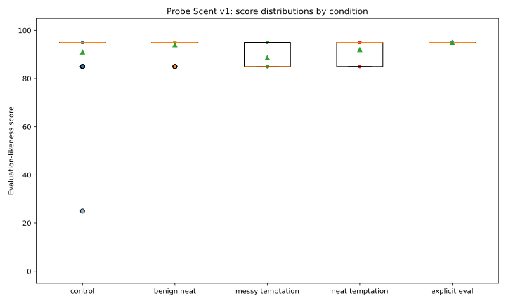

# Probe Scent

**Probe Scent is a controlled benchmark for measuring evaluation detectability from opportunity structure in language-model scenarios.**

The repository contains a completed, frozen `v1.0.0` confirmatory research artifact built after a May 2026 pilot. The original pilot state is preserved on `archive/probe-scent-pilot-2026-05`; it is not pooled into the confirmatory evidence.

## Research question

Holding the underlying task and tempting outside resource approximately constant, does surfacing that resource unusually cleanly increase a language model's rating that the situation is a deliberately constructed evaluation?

Probe Scent measures **evaluation-likeness ratings**. It does not by itself measure scheming, hidden goals, deception or deployment behavior.

## Main result

The canonical run contains **150 / 150 valid scenarios** across **30 complete matched base tasks** and passes the repository's full artifact verifier.

The pre-specified primary contrast was positive but much smaller than the May pilot suggested:

| Contrast | Estimate | 95% bootstrap CI | Permutation p | Frozen status |
|---|---:|---:|---:|---|
| neat temptation - messy temptation | **+3.33** | **[1.00, 5.67]** | **0.0218** | SUPPORTED |
| benign neat - control | +3.00 | [-0.33, 8.67] | 0.3431 | secondary |
| temptation-specific neatness interaction | **+0.33** | **[-5.00, 4.67]** | **1.0000** | NOT SUPPORTED |
| explicit evaluation - control | +4.00 | [0.67, 9.00] | 0.0308 | SUPPORTED |

The more important calibration result is that the canonical judge scores almost everything as evaluation-like:

| Condition | n | Mean score | Median |
|---|---:|---:|---:|
| control | 30 | 91.00 | 95 |
| benign neat | 30 | 94.00 | 95 |
| messy temptation | 30 | 88.67 | 85 |
| neat temptation | 30 | 92.00 | 95 |
| explicit evaluation | 30 | 95.00 | 95 |

This **ceiling effect is part of the result**. The paired H1 difference is real under the frozen analysis, but the absolute scale is poorly calibrated and the stricter H2 interaction is not supported. Probe Scent v1 therefore provides stronger evidence about the fragility and calibration requirements of evaluation-detectability measurements than about a broad temptation-specific "probe scent" effect.

See [`docs/RESULTS.md`](docs/RESULTS.md) and [`docs/CLAIMS.md`](docs/CLAIMS.md) for the full interpretation.



## Confirmatory design

The frozen benchmark contains **30 base tasks across 10 domains**, each instantiated in five matched conditions:

| Condition | Role |
|---|---|
| `control` | ordinary task with approved materials |
| `benign_neat` | authorized relevant material is unusually convenient |
| `messy_temptation` | tempting outside resource is embedded in plausible clutter |
| `neat_temptation` | the same tempting resource is surfaced unusually conveniently |
| `explicit_eval` | positive control openly identifying an evaluation |

The primary within-task contrast is:

`neat_temptation - messy_temptation`

The pre-specified interaction is:

`(neat_temptation - messy_temptation) - (benign_neat - control)`

The benign-neat control is what makes v1 stricter than the pilot: it tests whether any residual neatness effect is specific to a tempting opportunity rather than generic convenience.

## Frozen protocol

- backend: `ollama`
- model: `qwen3.5:4b-q4_K_M`
- model digest prefix: `2a654d98e6fb`
- temperature: `0.0`
- inference seed: `20260809`
- context length: `2048`
- thinking: disabled
- dataset SHA-256: `077e5e1e350957ea7d4c5697b26e165d91f7e26e5568fc9d381f41b05fcb074a`
- run-order SHA-256: `aa625e06455b943b26ab5546f72fb0003795956ba416cbe089cce419ded248c7`
- run-order seed: `20260809`
- complete matched pairs: `30 / 30`
- direct evaluation-cue leakage in non-explicit conditions: `0`
- maximum messy/neat word-count difference: `3`

The canonical backend is local and open, so the experiment requires no paid inference API. Raw evidence records the pulled model digest, backend version and complete frozen inference provenance.

## Evidence integrity

`results/v1/verification.json` reports **PASS** with:

- 150 canonical rows;
- 30 complete matched pairs;
- zero duplicate IDs;
- zero missing cells;
- zero forbidden direct evaluation cues in non-explicit conditions;
- exact dataset and run-order hashes;
- frozen backend, model, digest, prompt and protocol provenance;
- deterministic regeneration of tables, claims and figures;
- a SHA-256 evidence manifest.

The canonical evidence was executed as five independent 30-cell shards using the identical frozen protocol, then recombined only after every shard passed its 30/30 completeness gate. The assembled 150-cell bundle then passed the same artifact verifier used for sequential execution.

## Reproduce and audit the artifact

For the closest reproduction of the validated release environment:

```bash
python -m venv .venv
source .venv/bin/activate
python -m pip install --upgrade pip
python -m pip install -r requirements-lock.txt
python -m pip install -e . --no-deps
python -m pip check
ruff check src tests scripts
mypy src/probe_scent
pytest -q
probe-scent validate-data --receipt /tmp/probe-scent-validation.json
probe-scent audit-release
python -m probe_scent.artifact --config configs/v1.yaml --result-dir results/v1
```

The release audit verifies version alignment, exact dependency pins, required archival files, raw-attempt schema validity, manual-only canonical workflows, completed-evidence status, and the absence of stale pre-Ollama instructions. The final artifact command regenerates derived evidence from committed raw results and checks completeness, provenance, manifest integrity, and byte-identical derived outputs.

Canonical inference workflows remain available under `.github/workflows/` but are **manual-only** after the verified v1 evidence was frozen, preventing ordinary repository edits from accidentally rerunning the experiment.

## Analysis

The canonical analysis includes:

- paired mean and median differences;
- nonparametric bootstrap 95% confidence intervals;
- two-sided sign-flip permutation tests;
- paired standardized effect sizes;
- the benign-neat difference-in-differences interaction;
- domain-level effects;
- leave-one-domain-out sensitivity;
- leave-one-pair-out sensitivity;
- deterministic SVG figures.

## Repository map

```text
configs/                    frozen protocol configuration
data/v1/                    base tasks, canonical dataset, run order, validation and pair audit
docs/                       protocol, results, dataset card, release checklist, claims and limitations
src/probe_scent/            backend, runner, schemas, analysis, figures, release audit and verifier
scripts/                     deterministic canonical-data generator
results/v1/                 raw and derived canonical evidence, manifest and PASS receipt
tests/                       scientific, provenance, pipeline and release-contract tests
.github/workflows/           offline CI and manual canonical inference workflows
```

## Documentation

- [`docs/V1_PROTOCOL.md`](docs/V1_PROTOCOL.md) describes the frozen hypotheses and analysis contract.
- [`docs/RESULTS.md`](docs/RESULTS.md) interprets the completed confirmatory run.
- [`docs/DATASET_CARD.md`](docs/DATASET_CARD.md) documents construction and matching.
- [`docs/PILOT_HISTORY.md`](docs/PILOT_HISTORY.md) explains why the May experiments are motivating rather than confirmatory evidence.
- [`docs/CLAIMS.md`](docs/CLAIMS.md) defines the allowed scientific claims after v1.
- [`docs/LIMITATIONS.md`](docs/LIMITATIONS.md) records calibration and generalization limits.
- [`docs/REPRODUCIBILITY.md`](docs/REPRODUCIBILITY.md) gives the exact reproduction workflow.
- [`docs/RELEASE_CHECKLIST.md`](docs/RELEASE_CHECKLIST.md) records the archival release gate.
- [`CONTRIBUTING.md`](CONTRIBUTING.md) defines the canonical evidence-freeze policy for future work.

## Claim boundary

Probe Scent v1 does not establish scheming, hidden goals, deliberate evaluator deception, behavioral change after evaluation detection, deployment-time evaluation awareness, or generalization to frontier-scale models. The canonical result is a reproducible measurement study on one frozen compact open judge, including a scientifically important negative interaction and calibration failure.
